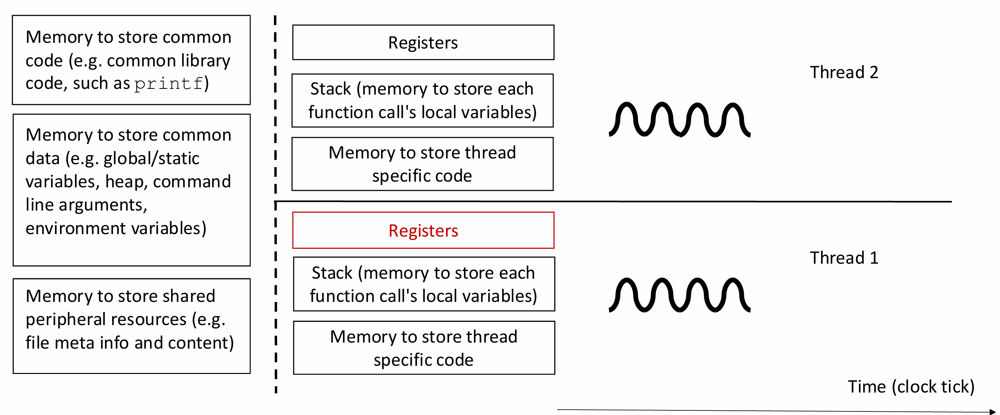
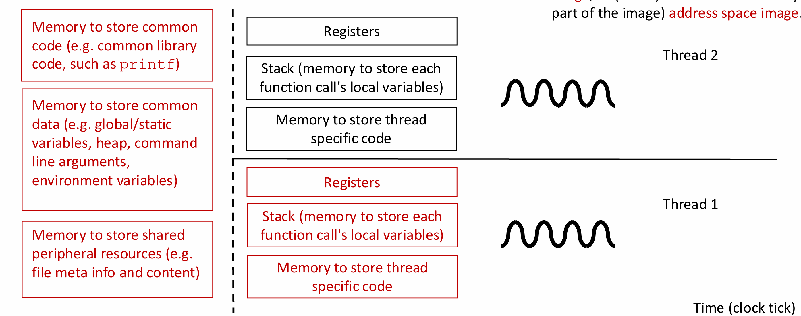

# Unix Processes

> What is a process? 
> What does a process look like in the system? 
> When is a process created? By whom?
> How is a process created? In how many ways? 
> When does a process stop? Can we wait for a process to die? 
> What is a process called if it never die?

## Common definition

` Process is dynamic while program is static.`

def -> A process is an instance of a program in execution

如何定义一个Unix processes的 status

 **s(e, i)** = `(resources used by e at i)`

`e` **系统调用事件：**

- `fork()`, `exec()`, `exit()`
- `read()`, `write()`, `open()`

Process 是time sequence 的两个连续的status 可以用如此表示:

s(e,i) and s(e, j+1)

## 一个Program ->Process

```
Programe is read into memory

A unique process ID is assigned

OS kernel creates a process structure instance（进程结构实例） to record information related to this process

Necessary resources to run the program are allocated
```

## lightweight processes

不知道有什么用的废话总结一下：

**以前的OSs 每个process 是独占（exclusive）资源的，浪费，现在设计下的OSs是Shared Resources，这种是lightweight processes**（typically created by a same ancestor process.）

```
传统进程模型：
进程A [内存空间A] [资源A]
进程B [内存空间B] [资源B]

线程模型：
进程 [共享内存空间] [共享资源]
  ├── 线程1 [独立栈] [独立寄存器]
  ├── 线程2 [独立栈] [独立寄存器]  
  └── 线程3 [独立栈] [独立寄存器]
```

###  share and  not to share



多线程里，需要进行 寄存器分割（register partitioning）

> 如何在不同线程间管理和分配CPU寄存器资源

`1 Complete Context Switching`

```
线程A运行时：使用所有寄存器
线程切换：
  - 保存线程A的所有寄存器到内存
  - 从内存恢复线程B的所有寄存器
线程B运行时：使用所有寄存器
```

**优点：简单直接，每个线程都能使用全部寄存器**

**缺点：切换开销大**

`2 Static Partitioning` -**原理：** 预先将寄存器分配给不同线程

`3 Dynamic Partitioning`-**原理：** 根据线程需求动态分配寄存器


## Programming interface for thread

**PThread (POSIX Thread).** -C的库

Unix的OSs对PThread实现都不一样

但是Linux是一致的

`in the Linux  implementation, there is a parent COW process creating a child COW process.`

## 进程映像（process image/execution environment  image,）

> process image是某个时刻进程的**完整状态快照**，包含了重新创建该进程所需的所有信息。

组成部分：

1. Address Space Image

2. CPU status
3. 操作系统管理信息

会储存这些内容：



## Process Management

每个进程有个PID（ProcessID）

 Unix OS 会保留Process的层级（parent-child links）

meta info:

```
 Process ID – integer PID
 Parent process ID – an integer PPID
 User process ID – an integer UID
 In Unix, each user has a unique user ID.
```

` C ` 里面可以用 `getpid`, `getppid,` and `getuid` 可以获取对应的ID

列出meta info 的指令：

```
ps 
列出当前进程
ps -a
列出更多进程，包括其他用户在其他终端运行的进程（但不包括 shell）

ps -l
打印更长的信息行，包括 UID、PID、PPID、进程状态等信息

```

### Fork进程和wait

`fork() `

​	1.在子进程中：返回 0. 

​	 2.在父进程中：返回子进程的PID（正数）

​	 3.失败时：返回 -1

wait() 系统调用

```C
#include <sys/wait.h>
pid_t wait(int *status);
```

**基本行为：**

- 阻塞调用进程，直到**任意一个子进程**终止
- 返回终止的子进程PID
- 通过status参数返回子进程的退出信息

waitpid() 系统调用

```c
pid_t waitpid(pid_t pid, int *status, int options);
```

pid参数：

```C
pid > 0   // 等待特定PID的子进程
pid == 0  // 等待同进程组的任意子进程  
pid == -1 // 等待任意子进程（等同于wait()）
pid < -1  // 等待进程组ID为|pid|的任意子进程
```

 Otherwise, wait returns –1 and set errno. 

errno == ECHILD indicates that there were no unwaited-for child processes; 

errno == EINTR indicates that the call was interrupted by a signal;


### exec 系统调用

>  用新程序完全替换当前进程的程序映像。

**程序替换（Program Replacement）：**

- 保持**进程ID不变**
- **完全替换**进程的内存映像（代码、数据、堆、栈）
- 重置进程状态，开始执行新程序

```c
#include <unistd.h>

// 最基础的系统调用
int execve(const char *pathname, char *const argv[], char *const envp[]);

// 便利包装函数
int execl(const char *pathname, const char *arg, ...);
int execlp(const char *file, const char *arg, ...);
int execle(const char *pathname, const char *arg, ..., char *const envp[]);
int execv(const char *pathname, char *const argv[]);
int execvp(const char *file, char *const argv[]);
int execvpe(const char *file, char *const argv[], char *const envp[]);
```

```
exec + [l/v] + [p] + [e]

l: list - 参数以列表形式传递
v: vector - 参数以数组形式传递
p: path - 在PATH环境变量中搜索程序
e: environment - 显式传递环境变量
```

## process termination

进程终止时，操作系统会释放该进程持有的资源，更新相应的统计信息，并通知其他进程

具体流程：

``` 
 • cancel pending timers and signals;
 • release virtual memory spaces;
 • release locks, closing open files;
 • notifying the parent in response to a wait system call
```

进程终止可以通过多种方式发生：

- **正常退出**：调用 `exit()` 或 `_exit()`
- **异常终止**：收到致命信号（如SIGKILL、SIGSEGV）
- **被父进程终止**：父进程发送信号

### 僵尸进程的形成

进程终止后，如果父进程没有及时调用wait()：

### abnormal process termination

异常进程终止是指进程**非正常结束**的情况，不是通过标准的exit()系统调用主动退出，而是被外部因素强制终止或因内部错误而崩溃。

两种abnormal termination

 • calling abort, causing the SIGABRT signal to be sent to the calling process

```
// 常见的致命信号
SIGKILL  (9)   // 强制杀死，无法捕获或忽略
SIGTERM  (15)  // 终止请求，可以被处理
SIGSEGV  (11)  // 段错误（内存访问违规）
SIGBUS   (7)   // 总线错误
SIGFPE   (8)   // 浮点异常
SIGABRT  (6)   // 异常终止（abort()调用）
SIGQUIT  (3)   // 退出信号（Ctrl+\）
SIGINT   (2)   // 中断信号（Ctrl+C）
```

 • processing a signal that causes termination.

### Background Processes 和 Daemons 

**Background Processes 定义：** 在后台运行的进程，不与用户终端直接交互，允许用户继续在前台执行其他命令。

```
# 在shell后加 & 符号
sleep 100 &          # 后台睡眠100秒
find / -name "*.txt" > results.txt 2>&1 &  # 后台搜索文件

# 查看后台作业
jobs
[1]+  Running    sleep 100 &

# 将作业调到前台
fg %1

# 将前台作业调到后台
# 先按 Ctrl+Z 暂停，然后：
bg %1
```

**Daemons (守护进程)定义：** 守护进程是在系统后台运行的特殊系统进程，通常在系统启动时启动，持续运行直到系统关闭。它们没有控制终端，独立于用户会话。

 • pageout daemon handling paging, 

 • in.rlogind handling remote login requests, 

 • The web server daemon receiving http connection requests 

 • ftp daemon, mail daemon, … etc